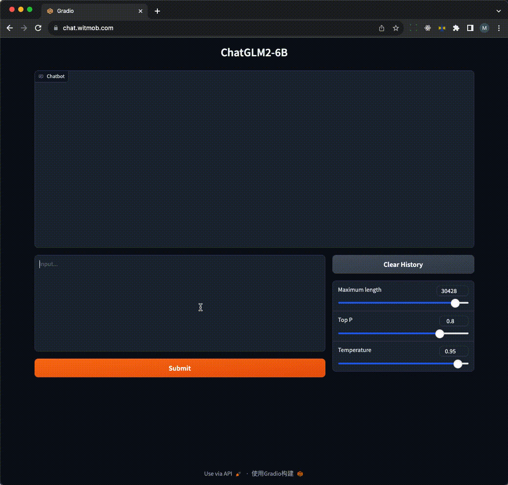

# ChatGLM2 Docker

使用 ChatGLM2 6B 模型的聊天机器人服务。

基于硬件：`nvidia tesla t4 16GB`



## 基本思路

- 一键访问
    - 一个命令 `./apply.sh` 实现自动部署, 包括域名设置
    - 打开浏览器访问：https://your-domain 
- 快速完成，大约 1 分钟内即可访问 
    - 目前正常使用还需要几分钟更新 huggingface checkpoint
    - 是可以避免的，需要通过 gradio 设置
- 第一次安装配置过程较长，生成镜像后就可以很快访问了
- 随时访问，随时创建，用完就销毁
- 基于竞价/抢占类型的付费，很便宜，1 次完整的镜像生成 `¥3.5`

## 使用的技术/服务

- dns: https://www.dnspod.cn/ 基于 restful api 实现自动添加 dns 记录
- terraform: 
    - 自动生成/销毁云端基础设施，包括 vm，网络，安全策略等
    - 使用阿里云实现了完整功能
    - 使用腾讯云实现了主要功能（还不能自动化）
- docker
    - 在 vm 上通过 docker 容器使用 cuda/cudnn/pytorch
    - vm 只需要安装 nvidia driver 即可
- traefik 
    - 作为 chatglm/gradio 的代理
    - 使用 letsencrypt 和 dnspod 实现基于 dns chanllenge 的自动获取 ssl 证书


## 准备镜像

### 公有云 key 的设置

设置环境变量，terraform 需要相关变量访问云端服务：

```bash
export TENCENTCLOUD_SECRET_ID=xxxxx
export TENCENTCLOUD_SECRET_KEY=xxxxx
# export TENCENTCLOUD_REGION=ap-beijing

export ALICLOUD_ACCESS_KEY=xxxxx
export ALICLOUD_SECRET_KEY=xxxxx
# export ALICLOUD_REGION="cn-beijing"
```

### 制作镜像


参考 `terraform/alicoud/main.tf`，改为自己的参数，然后启动 vm：

```bash
# 创建 chatglm vm
cd terraform/alicoud
terraform apply

# 上传本地文件
scp ../../docker-compose.yaml root@ip_address:~
scp ../../Dockerfile root@ip_address:~
scp ../../.env root@ip_address:~
```

登录服务器 `ssh root@ip_address`:

```bash
# 系统更新和升级
sudo apt update && sudo apt upgrade -y

# 自动安装驱动
sudo ubuntu-drivers autoinstall
# 或者指定版本
sudo apt install nvidia-driver-525 -y -qq
# 需要重启
sudo reboot


# 测试驱动是否有效
nvidia-smi

# 安装 docker
curl -fsSL https://get.docker.com -o get-docker.sh
sudo sh get-docker.sh

# 安装 nvidia container toolkit
curl -fsSL https://nvidia.github.io/libnvidia-container/gpgkey | sudo gpg --dearmor -o /usr/share/keyrings/nvidia-container-toolkit-keyring.gpg \
  && curl -s -L https://nvidia.github.io/libnvidia-container/stable/deb/nvidia-container-toolkit.list | \
    sed 's#deb https://#deb [signed-by=/usr/share/keyrings/nvidia-container-toolkit-keyring.gpg] https://#g' | \
    sudo tee /etc/apt/sources.list.d/nvidia-container-toolkit.list \
  && \
    sudo apt-get update
sudo apt-get install nvidia-container-toolkit -qq -y
sudo systemctl restart docker

# 构建 chatglm 镜像
docker compose build

# 启动 ChatGLM2 服务
# 第一次会很慢，因为要通过 huggingface 下载模型文件，约12GB
docker compose up -d
```

能通过浏览器正常访问，即可将 vm 生成为镜像，将 `image_id` 设置到 `main.tf` 文件中，后续就可以快速部署使用了。

## 使用

```bash
# 创建 vm 
./apply.sh

# 启动 chatglm
./start.sh

# 销毁 vm
./destroy.sh
```

## 其他

- 生成的镜像也可以匹配其他型号的 nvidia gpu，比如 `a10 24GB`
